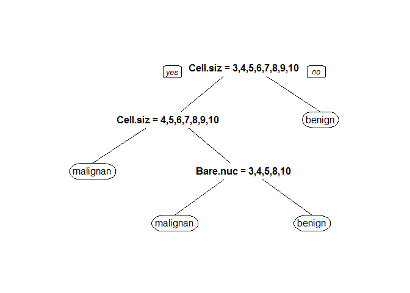

乳癌預測模型
================

資料前處理
----------

### 資料解釋

此資料來源為UCI Machine Learning Repository。

資料內共紀錄699個病人資料，用來預測病人的乳房腫瘤是良性還是陰性，裡頭包含了11個參數，例如細胞大小等等...。分類結果為二元分類，包刮陰性(malignant)與良性(benign)。

### 資料讀取

``` r
#install.packages("mlbench")
library(mlbench)
```

    ## Warning: package 'mlbench' was built under R version 3.2.5

``` r
data(BreastCancer)
str(BreastCancer)
```

    ## 'data.frame':    699 obs. of  11 variables:
    ##  $ Id             : chr  "1000025" "1002945" "1015425" "1016277" ...
    ##  $ Cl.thickness   : Ord.factor w/ 10 levels "1"<"2"<"3"<"4"<..: 5 5 3 6 4 8 1 2 2 4 ...
    ##  $ Cell.size      : Ord.factor w/ 10 levels "1"<"2"<"3"<"4"<..: 1 4 1 8 1 10 1 1 1 2 ...
    ##  $ Cell.shape     : Ord.factor w/ 10 levels "1"<"2"<"3"<"4"<..: 1 4 1 8 1 10 1 2 1 1 ...
    ##  $ Marg.adhesion  : Ord.factor w/ 10 levels "1"<"2"<"3"<"4"<..: 1 5 1 1 3 8 1 1 1 1 ...
    ##  $ Epith.c.size   : Ord.factor w/ 10 levels "1"<"2"<"3"<"4"<..: 2 7 2 3 2 7 2 2 2 2 ...
    ##  $ Bare.nuclei    : Factor w/ 10 levels "1","2","3","4",..: 1 10 2 4 1 10 10 1 1 1 ...
    ##  $ Bl.cromatin    : Factor w/ 10 levels "1","2","3","4",..: 3 3 3 3 3 9 3 3 1 2 ...
    ##  $ Normal.nucleoli: Factor w/ 10 levels "1","2","3","4",..: 1 2 1 7 1 7 1 1 1 1 ...
    ##  $ Mitoses        : Factor w/ 9 levels "1","2","3","4",..: 1 1 1 1 1 1 1 1 5 1 ...
    ##  $ Class          : Factor w/ 2 levels "benign","malignant": 1 1 1 1 1 2 1 1 1 1 ...

### 資料前處理

留下沒有缺值的資料，並把無關病情的資料拿掉(ID)

``` r
BreastCancerC<-BreastCancer[complete.cases(BreastCancer),
!names(BreastCancer) %in% c("Id")] 
c(nrow(BreastCancer),nrow(BreastCancerC))
```

    ## [1] 699 683

### 將資料隨機分為訓練組與測試組

隨機將2/3的資料分到訓練組（Test==F），剩下1/3為測試組（Test==T)

``` r
#install.packages("rpart")
library(rpart)
BreastCancerC$Test<-F 
BreastCancerC[
    sample(1:nrow(BreastCancerC),nrow(BreastCancerC)/3),
    ]$Test<-T 

c(sum(BreastCancerC$Test==F),sum(BreastCancerC$Test==T)) 
```

    ## [1] 456 227

可得訓練組案例數為456測試組案例數為227

預測模型建立
------------

### 模型建立

由於變數多，且多為連續變項，而輸出為二元類別變項，故選擇決策樹演算法來建立模型。

``` r
#install.packages("rpart")
library(rpart)

BreastCancerC$Class<-factor(BreastCancerC$Class,levels=c("malignant","benign"))

#set.seed(1000)          
fit<-rpart(Class~.,data=BreastCancerC[BreastCancerC$Test==F,]) 

#install.packages("rpart.plot")
library(rpart.plot)
```

    ## Warning: package 'rpart.plot' was built under R version 3.2.5

``` r
prp(fit)
```

<!-- -->

``` r
summary(fit)
```

    ## Call:
    ## rpart(formula = Class ~ ., data = BreastCancerC[BreastCancerC$Test == 
    ##     F, ])
    ##   n= 456 
    ## 
    ##          CP nsplit  rel error    xerror       xstd
    ## 1 0.8304094      0 1.00000000 1.0000000 0.06045635
    ## 2 0.0380117      1 0.16959064 0.1929825 0.03235554
    ## 3 0.0100000      3 0.09356725 0.1345029 0.02732935
    ## 
    ## Variable importance
    ##       Cell.size      Cell.shape    Epith.c.size     Bare.nuclei 
    ##              22              17              16              15 
    ##     Bl.cromatin Normal.nucleoli   Marg.adhesion 
    ##              15              14               1 
    ## 
    ## Node number 1: 456 observations,    complexity param=0.8304094
    ##   predicted class=benign     expected loss=0.375  P(node) =1
    ##     class counts:   171   285
    ##    probabilities: 0.375 0.625 
    ##   left son=2 (188 obs) right son=3 (268 obs)
    ##   Primary splits:
    ##       Cell.size    splits as  RRLLLLLLLL, improve=161.6463, (0 missing)
    ##       Cell.shape   splits as  RRRLLLLLLL, improve=150.8343, (0 missing)
    ##       Bl.cromatin  splits as  RRRLLLLLLL, improve=140.8829, (0 missing)
    ##       Bare.nuclei  splits as  RRLLLLLLLL, improve=137.3553, (0 missing)
    ##       Epith.c.size splits as  RRLLLLLLLL, improve=132.6868, (0 missing)
    ##   Surrogate splits:
    ##       Cell.shape      splits as  RRLLLLLLLL, agree=0.919, adj=0.803, (0 split)
    ##       Epith.c.size    splits as  RRLLLLLLLL, agree=0.899, adj=0.755, (0 split)
    ##       Bare.nuclei     splits as  RRLLLLLLLL, agree=0.877, adj=0.702, (0 split)
    ##       Bl.cromatin     splits as  RRRLLLLLLL, agree=0.875, adj=0.697, (0 split)
    ##       Normal.nucleoli splits as  RRLLLLLLLL, agree=0.868, adj=0.681, (0 split)
    ## 
    ## Node number 2: 188 observations,    complexity param=0.0380117
    ##   predicted class=malignant  expected loss=0.1223404  P(node) =0.4122807
    ##     class counts:   165    23
    ##    probabilities: 0.878 0.122 
    ##   left son=4 (154 obs) right son=5 (34 obs)
    ##   Primary splits:
    ##       Cell.size     splits as  RRRLLLLLLL, improve=11.83987, (0 missing)
    ##       Bare.nuclei   splits as  RRRLLLLLLL, improve=10.29334, (0 missing)
    ##       Cell.shape    splits as  RRRLLLLLLL, improve=10.06753, (0 missing)
    ##       Bl.cromatin   splits as  RRRLLLLLLL, improve= 8.81141, (0 missing)
    ##       Marg.adhesion splits as  RRLLLLLLLL, improve= 6.68926, (0 missing)
    ##   Surrogate splits:
    ##       Cell.shape    splits as  RRRLLLLLLL, agree=0.883, adj=0.353, (0 split)
    ##       Bl.cromatin   splits as  RLLLLLLLLL, agree=0.851, adj=0.176, (0 split)
    ##       Cl.thickness  splits as  RRRLLLLLLL, agree=0.835, adj=0.088, (0 split)
    ##       Marg.adhesion splits as  RLLLLLLLLL, agree=0.830, adj=0.059, (0 split)
    ##       Epith.c.size  splits as  RRLLLLLLLL, agree=0.830, adj=0.059, (0 split)
    ## 
    ## Node number 3: 268 observations
    ##   predicted class=benign     expected loss=0.02238806  P(node) =0.5877193
    ##     class counts:     6   262
    ##    probabilities: 0.022 0.978 
    ## 
    ## Node number 4: 154 observations
    ##   predicted class=malignant  expected loss=0.03896104  P(node) =0.3377193
    ##     class counts:   148     6
    ##    probabilities: 0.961 0.039 
    ## 
    ## Node number 5: 34 observations,    complexity param=0.0380117
    ##   predicted class=malignant  expected loss=0.5  P(node) =0.0745614
    ##     class counts:    17    17
    ##    probabilities: 0.500 0.500 
    ##   left son=10 (19 obs) right son=11 (15 obs)
    ##   Primary splits:
    ##       Bare.nuclei     splits as  RRLLL--L-L, improve=10.080700, (0 missing)
    ##       Bl.cromatin     splits as  RRRLLRLL--, improve= 6.439394, (0 missing)
    ##       Normal.nucleoli splits as  RRLLRR--LL, improve= 6.120000, (0 missing)
    ##       Cell.shape      splits as  RRRLLLLLLL, improve= 5.442688, (0 missing)
    ##       Epith.c.size    splits as  RRRRLLLLLL, improve= 4.407407, (0 missing)
    ##   Surrogate splits:
    ##       Marg.adhesion   splits as  RRLLLLLLLL, agree=0.794, adj=0.533, (0 split)
    ##       Bl.cromatin     splits as  RRLLLRLL--, agree=0.765, adj=0.467, (0 split)
    ##       Normal.nucleoli splits as  RRLLLL--LL, agree=0.735, adj=0.400, (0 split)
    ##       Cell.shape      splits as  RLLLLLLLLL, agree=0.676, adj=0.267, (0 split)
    ##       Epith.c.size    splits as  RRLLLLLLLL, agree=0.676, adj=0.267, (0 split)
    ## 
    ## Node number 10: 19 observations
    ##   predicted class=malignant  expected loss=0.1578947  P(node) =0.04166667
    ##     class counts:    16     3
    ##    probabilities: 0.842 0.158 
    ## 
    ## Node number 11: 15 observations
    ##   predicted class=benign     expected loss=0.06666667  P(node) =0.03289474
    ##     class counts:     1    14
    ##    probabilities: 0.067 0.933

### 模型說明

由上述參數可知，以決策樹建立模型預測乳房腫瘤是否為陰性或良性，經最佳化後，所用到的參數為上圖的決策樹所示

預測模型驗證
------------

``` r
#install.packages("caret")
library(caret)
```

    ## Warning: package 'caret' was built under R version 3.2.5

    ## Loading required package: lattice

    ## Loading required package: ggplot2

    ## Warning: package 'ggplot2' was built under R version 3.2.5

``` r
MinePred<-predict(fit,newdata = BreastCancerC[BreastCancerC$Test==T,],type = "class")

sensitivity(MinePred,BreastCancerC[BreastCancerC$Test==T,]$Class)
```

    ## [1] 0.9230769

``` r
specificity(MinePred,BreastCancerC[BreastCancerC$Test==T,]$Class)
```

    ## [1] 0.9530201

``` r
posPredValue(MinePred,BreastCancerC[BreastCancerC$Test==T,]$Class)
```

    ## [1] 0.9113924

``` r
negPredValue(MinePred,BreastCancerC[BreastCancerC$Test==T,]$Class)
```

    ## [1] 0.9594595

使用病患資料來預測乳房腫瘤是否為陰性或良性，以決策樹模型預測是否為陰性，可得：

-   敏感度 92.3076923%
-   特異性 95.3020134%
-   陽性預測率 91.1392405%
-   陰性預測率 95.9459459%
